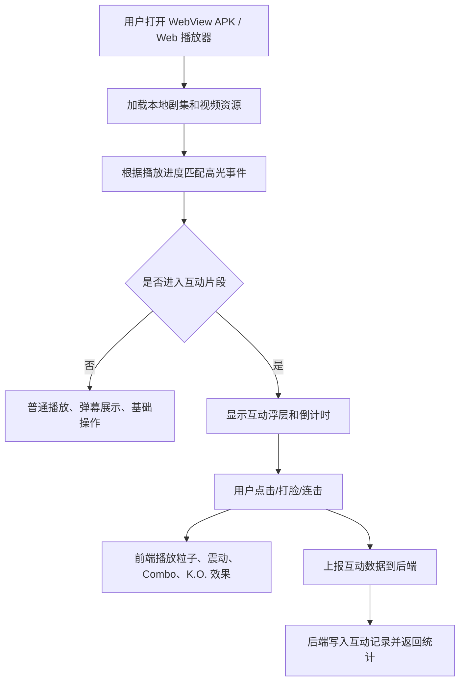
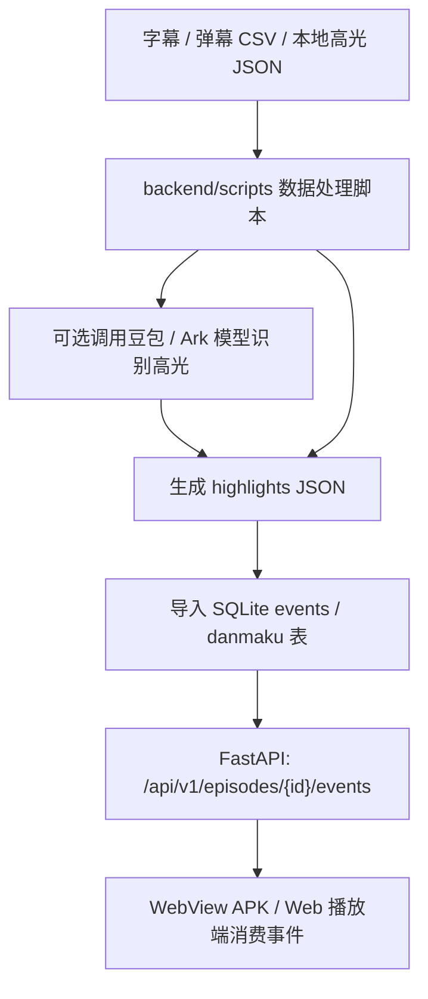
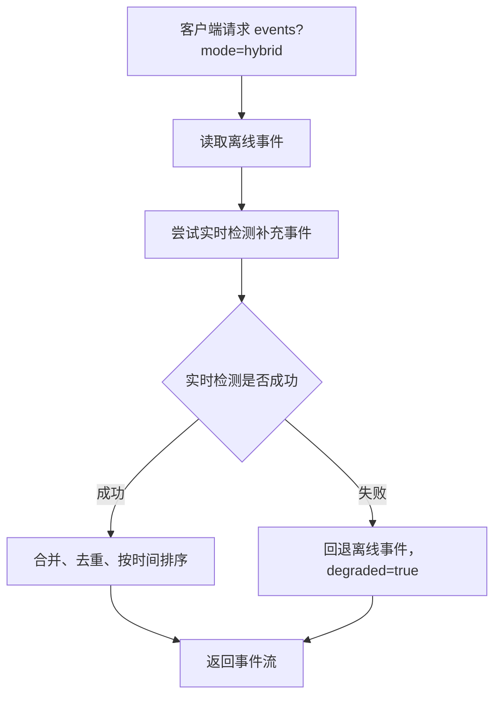

# 短剧互动平台技术文档

## 1. 项目概述

本项目实现一个短剧互动平台原型，面向竖屏短剧播放场景，在常规视频播放基础上叠加弹幕、高光事件、互动点击、打脸小游戏、粒子反馈和互动数据上报。项目采用前后端分离结构，最终交付口径为 Capacitor WebView APK + FastAPI 服务端，同一套 Web 端代码也可作为浏览器演示和联调入口。

## 2. 模块分析和拆解

| 模块 | 目录 | 职责 |
|---|---|---|
| WebView APK / Web 播放端 | `web/` | Vite Web 主界面，通过 Capacitor 封装 Android APK，包含竖屏播放器、弹幕层、打脸互动、粒子效果、进度与操作 UI |
| Expo 历史原型 | `mobile/` | Expo / React Native 原型工程，保留移动端组件参考，当前不作为主交付入口 |
| 后端服务 | `backend/app/` | FastAPI API 服务，提供剧集、弹幕、高光事件、互动上报、测验、同款搜索接口 |
| 数据处理脚本 | `backend/scripts/` | 弹幕导入、高光识别、事件导入、训练样本生成和冒烟测试 |
| 数据与契约 | `backend/data/`、`shared/` | 演示视频元数据、弹幕、高光 JSON、跨端事件字段契约 |
| 文档与演示 | `docs/`、`demo/` | 接口文档、技术文档、演示录屏和预览材料 |

## 3. 核心模块技术选型

| 方向 | 技术 | 选择原因 |
|---|---|---|
| 服务端框架 | FastAPI | 类型友好、接口文档自动生成、适合快速完成 API 原型 |
| 数据库 | SQLite + SQLAlchemy | 本地演示部署简单，同时保留 ORM 层便于后续切换 PostgreSQL |
| 后台任务骨架 | Celery + Redis | 为离线高光分析和批量导入任务预留异步执行能力 |
| Web 前端 | React + Vite + TypeScript | 启动快、构建简单、适合高互动播放器原型，并可输出静态资源供 WebView 加载 |
| Web 样式 | Tailwind CSS | 快速实现响应式竖屏播放器和状态反馈 |
| APK 封装 | Capacitor Android | 将 Web 主界面封装为 Android WebView APK，复用同一套播放器和互动逻辑 |
| 移动端历史原型 | Expo + React Native | 保留 Android/iOS 原型预览和组件参考 |
| 人脸/命中区域 | MediaPipe Face Mesh + bbox JSON | 支持打脸互动的脸部区域检测和本地兜底命中判断 |
| 模型接口 | OpenAI SDK 兼容火山 Ark / 豆包接口 | 支持字幕/片段高光识别，模型失败时可回退离线数据 |

## 4. 主要业务流程

### 4.1 播放互动流程



### 4.2 高光事件数据流



### 4.3 Hybrid 事件回退流程



## 5. 工作项拆分和排期

| 阶段 | 工作项 | 产出 |
|---|---|---|
| 第 1 阶段 | 项目结构设计、仓库初始化、数据契约设计 | monorepo、README、事件字段契约 |
| 第 2 阶段 | 后端 API、数据库模型、弹幕/事件导入脚本 | FastAPI 服务、SQLite 数据、基础接口 |
| 第 3 阶段 | Web 播放器、竖屏视频、弹幕层、互动按钮 | 可演示 Web 端主链路 |
| 第 4 阶段 | 打脸互动、脸部命中、粒子效果、Combo/K.O. | 互动玩法闭环 |
| 第 5 阶段 | Capacitor APK 封装、Web 资源离线内置、Android 工程生成 | 可构建 Android WebView APK |
| 第 6 阶段 | 测试、文档、录屏、最终交付整理 | 测试结果、技术文档、演示录屏和 APK 构建说明 |

## 6. 当前完成情况

- 后端提供健康检查、剧集、弹幕、事件流、互动上报、互动汇总、测验、同款搜索和高光检测接口。
- Web 端可运行竖屏短剧播放器，并在第 5 集触发打脸互动和粒子反馈，当前作为主界面。
- 已通过 Capacitor 生成 Android WebView APK 工程，Web 资源和短剧视频可离线内置到 APK。
- Expo / React Native 工程保留为历史原型和组件参考。
- 已提供后端 pytest 用例，覆盖事件 API、hybrid fallback、互动汇总、测验过滤等基础行为。
- `demo/` 中保留项目展示录屏素材。

## 7. AI 辅助说明

项目开发过程中使用 AI 辅助完成了以下工作：

- 辅助梳理 monorepo 结构、后端模块拆分和接口字段契约。
- 辅助生成 FastAPI 路由、Pydantic Schema、SQLAlchemy 模型和 pytest 用例。
- 辅助实现 Web 播放器中的互动状态、粒子反馈、打脸小游戏和高光触发逻辑。
- 辅助整理弹幕数据处理脚本、高光事件导入脚本和接口联调文档。
- 辅助编写 README、技术文档、部署说明和最终交付检查清单。

AI 主要用于代码生成、文档整理、测试补充和问题排查，项目需求取舍、功能验收和最终交付内容由开发者确认。

## 8. 验收方式

后端：

```powershell
cd backend
pytest -q
python -m uvicorn app.main:app --reload --host 0.0.0.0 --port 8000
```

Web：

```powershell
cd web
npm install
npm run dev
```

Android WebView APK：

```powershell
cd web
npm install
npm run android:apk
```

最终演示建议以 WebView APK 作为主展示入口，配合 `demo/` 录屏、后端 Swagger 文档和飞书技术文档完成验收；同一套 Web 端也可作为浏览器辅助演示入口。
